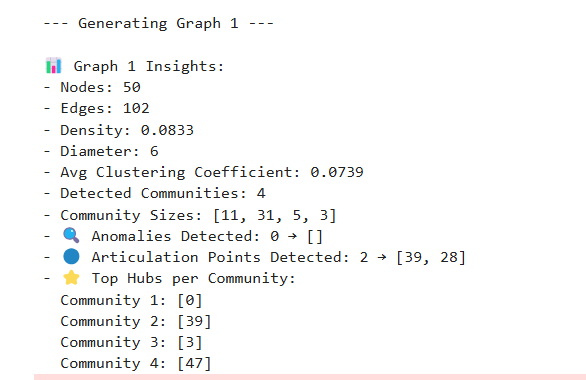

# 🧠 Community Detection and Role-Based Analysis in Social Networks

This project analyzes synthetic social networks using graph theory. It detects **communities**, identifies important **node roles** like **hubs**, **anomalies**, and **articulation points**, and visualizes them using dual encoding — all inside a single Jupyter notebook.

---

## 👤 Author

**Manan Sharma**  
GitHub: [@hereismanan](https://github.com/hereismanan)

---

## 📘 Features

- 📊 Generate random connected graphs using **Erdős–Rényi model**
- 🧩 Detect communities with **Girvan–Newman algorithm**
- 🌟 Identify:
  - **Hubs** (top-degree nodes per community)
  - **Anomalies** (statistical outliers)
  - **Articulation Points** (critical nodes that hold the graph together)
- 🎨 Visualize graph using:
  - Colors → Communities  
  - Size → Hubs  
  - Red Fill → Anomalies  
  - Blue Border → Articulation Points
- 📈 Print graph metrics: diameter, density, clustering, etc.

---

## 🛠 Technologies Used

- Python 3
- Jupyter Notebook
- [NetworkX](https://networkx.org/)
- [Matplotlib](https://matplotlib.org/)
- NumPy

---

## 🧪 Graph Metrics

- Number of nodes and edges
- Graph density
- Diameter (longest shortest path)
- Clustering coefficient
- Community sizes
- Roles: Anomalies, Hubs, Articulation Points

---

## 🚀 Getting Started

### 1. Clone the repository
```bash
git clone https://github.com/hereismanan/Community-Detection-and-Role-Based-Analysis-in-Social-Networks.git
cd Community-Detection-and-Role-Based-Analysis-in-Social-Networks
```

### 2. Install requirements
```bash
pip install -r requirements.txt
```

### 3. Launch the notebook
```bash
jupyter notebook
```

---

## 📷 Visual Output 

- Community Structure with role-encoded nodes  
- Printed metrics per graph  
- Subgraphs per community  

> ✳️ Red → Anomaly  
> ✳️ Blue Border → Articulation Point  
> ✳️ Large Gold → Hub

---
### 📷 Sample Output

#### Graph with Communities and Roles


#### Printed Metrics


## 🌍 Applications

- Social Network Analysis  
- Cybersecurity (critical node detection)  
- Infrastructure Planning  
- Recommender Systems  
- Biological Network Analysis

---
